<div align="center">


# Garage WebUI-NG

**A modern, production-ready admin dashboard for [Garage](https://garagehq.deuxfleurs.fr/) — the self-hosted, S3-compatible, distributed object storage service.**

[](https://github.com/d7eeem/garage-webui-ng/actions/workflows/ci.yml)
[](https://github.com/d7eeem/garage-webui-ng/actions/workflows/docker-publish.yml)
[](https://github.com/d7eeem/garage-webui-ng/pkgs/container/garage-webui-ng)
[](LICENSE)
[](backend/go.mod)
[](package.json)

[Features](#-key-features) · [Screenshots](#-screenshots) · [Quick Start](#-installation) · [Configuration](#-configuration) · [API](#-api) · [Authentication](docs/authentication.md) · [Upgrading](docs/UPGRADING.md) · [Roadmap](#-roadmap)

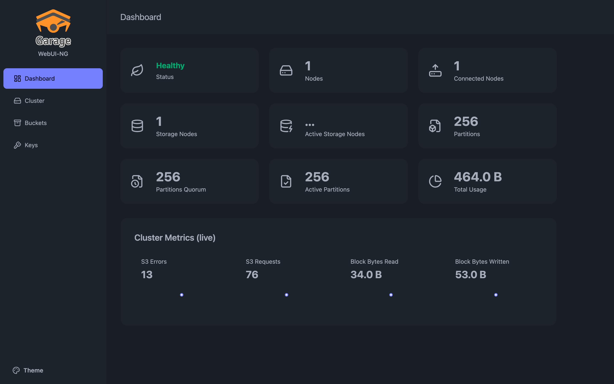

</div>

---

## 📖 Overview

**Garage WebUI-NG** is the next-generation web console for operating a [Garage](https://garagehq.deuxfleurs.fr/) cluster. It ships as a **single, self-contained binary** (a Go backend that embeds the compiled React frontend) or as a **~12 MB non-root Docker image**. It is a thin, secure gateway to your existing Garage cluster; the only state it owns is a small SQLite database of its own user accounts.

Point it at a running Garage node and you get a clean dashboard for cluster health, buckets, objects, access keys, static-website hosting, and object sharing — with built-in user management, a read-only operator role, and a structured audit trail.

## ✨ Key Features

- **📊 Live dashboard** — cluster health, node/partition status, total usage, and a live metrics panel (S3 requests, errors, block I/O) parsed from Garage's Prometheus endpoint.
- **🗂️ Bucket management** — create, inspect, and configure buckets: global/local aliases, quotas, and **static website hosting** with a correct, copy-ready public URL.
- **📁 Object browser** — navigate prefixes, upload and download objects, create folders, **bulk-delete** selections, and clean up orphaned **multipart uploads**.
- **🔗 Object sharing** — generate expiring **presigned links** for private objects and surface public website URLs, all from one dialog.
- **🔑 Access keys** — create, inspect, and assign keys to buckets with fine-grained read / write / owner permissions.
- **🔐 Users & roles** — a **first-run setup wizard**, in-app user management (**Settings → Users**), admin / fail-closed read-only **viewer** roles, self-service password change, and CSRF-protected sessions. No hand-edited environment variables. See [`docs/authentication.md`](docs/authentication.md).
- **📝 Audit log** — every state-changing request is emitted as a structured JSON line to stdout (who / what / path / status), including denied writes.
- **🎨 Themed UI** — 10 built-in light/dark themes, fully responsive down to mobile.
- **🚀 Production-ready** — multi-arch (amd64/arm64) image, non-root runtime, healthcheck, graceful shutdown, and GHCR publishing out of the box.

## 📸 Screenshots

<div align="center">

| Dashboard | Buckets |
|:---:|:---:|
| [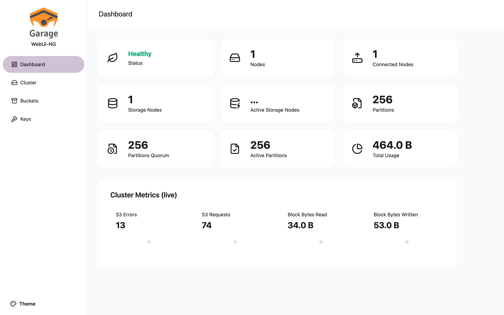](docs/screenshots/dashboard-light.png) | [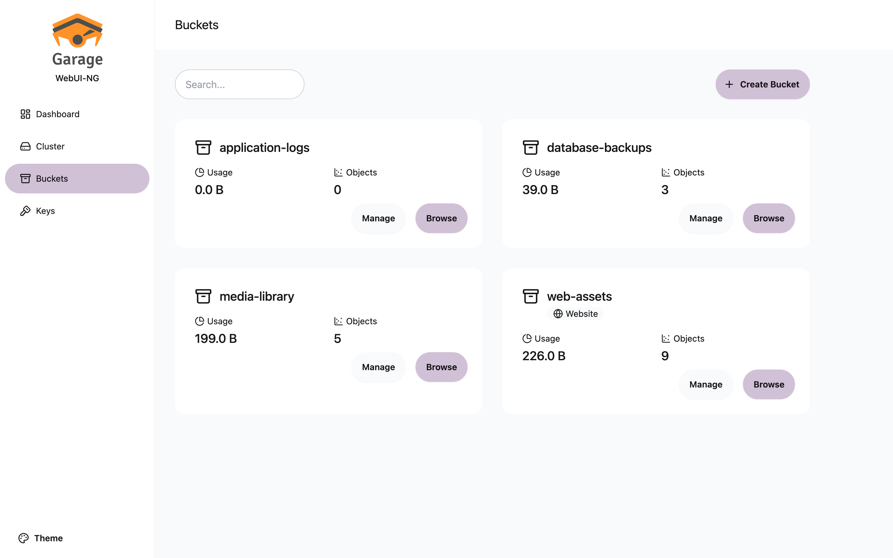](docs/screenshots/buckets-light.png) |
| **Object browser** | **Bucket overview** |
| [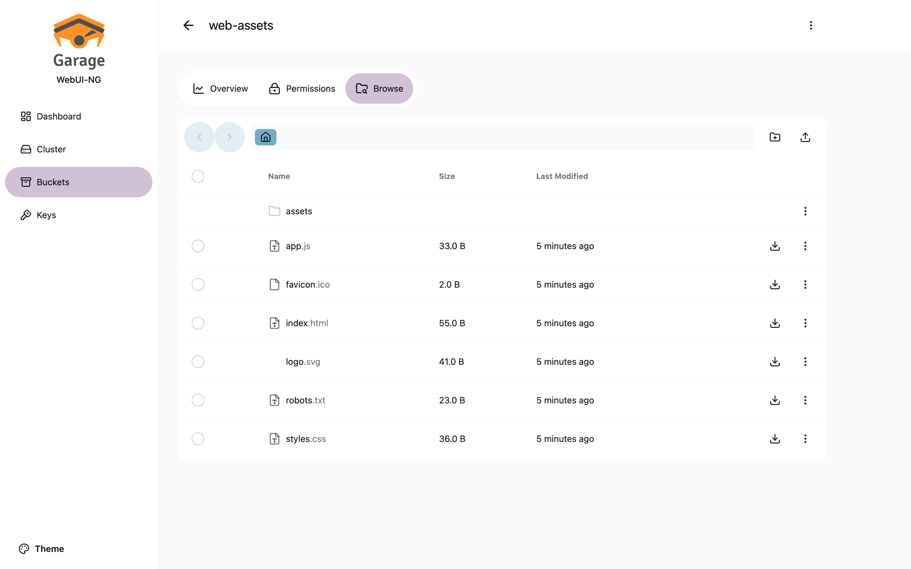](docs/screenshots/browse-light.png) | [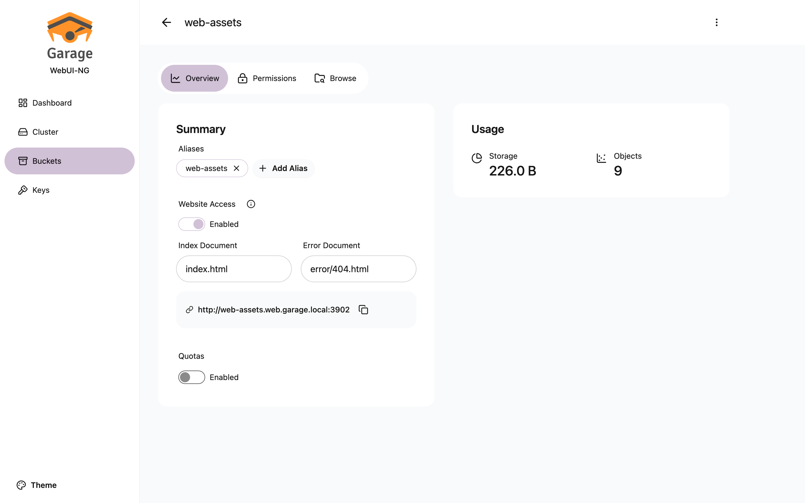](docs/screenshots/bucket-overview-light.png) |
| **Access keys** | **Cluster & layout** |
| [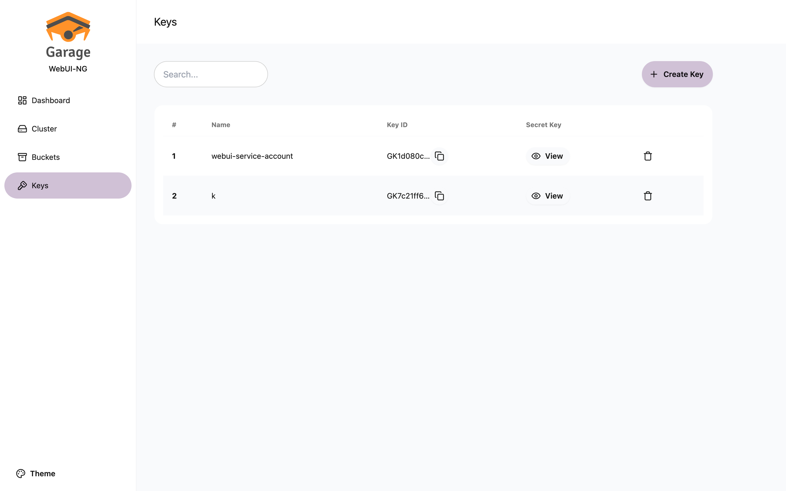](docs/screenshots/keys-light.png) | [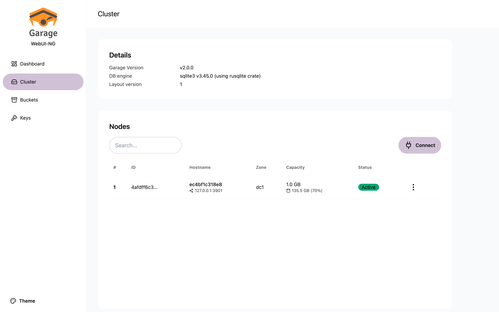](docs/screenshots/cluster-light.png) |

**Share / export dialog** — presigned private links + public website URL

[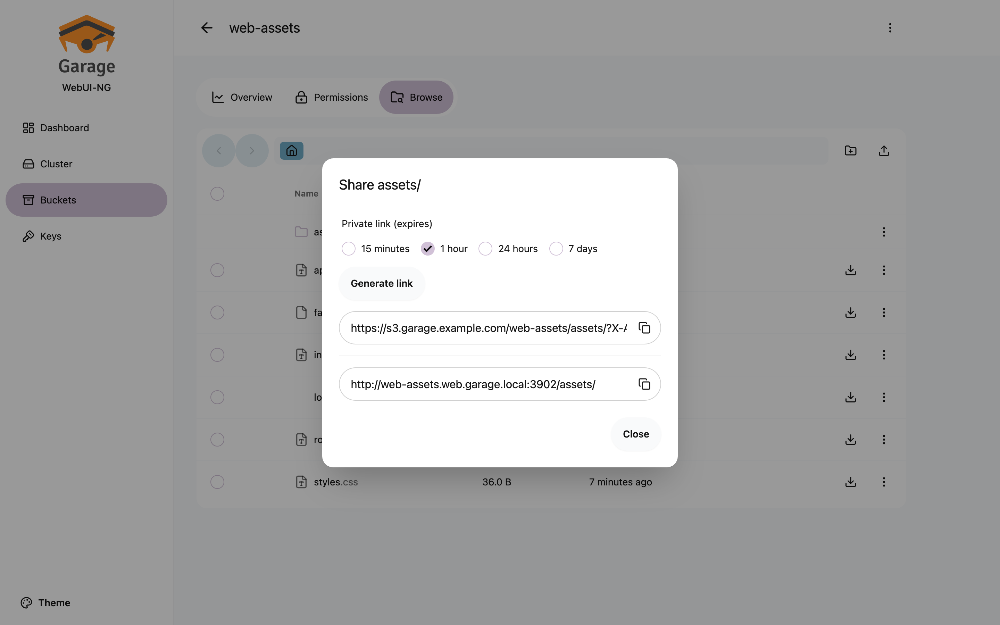](docs/screenshots/share-export.png)

**First-run setup wizard** — the one-time administrator account on a brand-new instance

[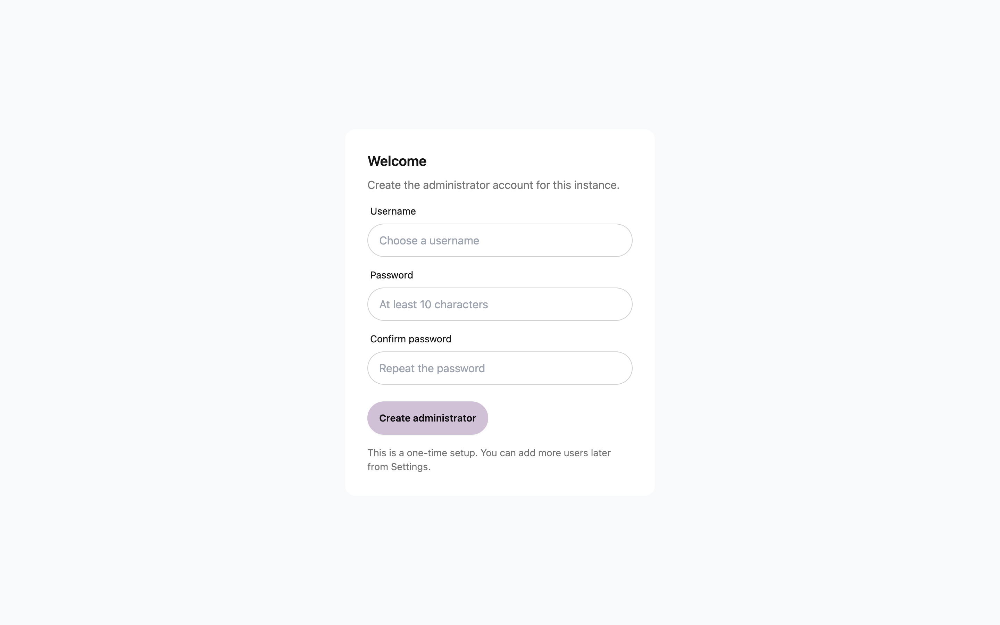](docs/screenshots/setup-wizard.png)

| Settings → Users | Settings → Account |
|:---:|:---:|
| [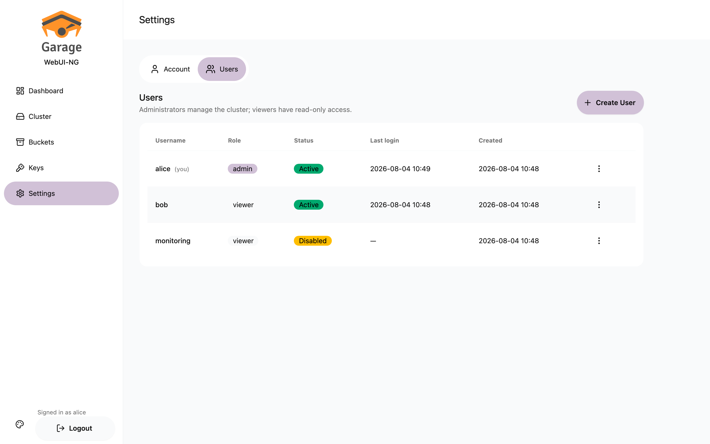](docs/screenshots/settings-users.png) | [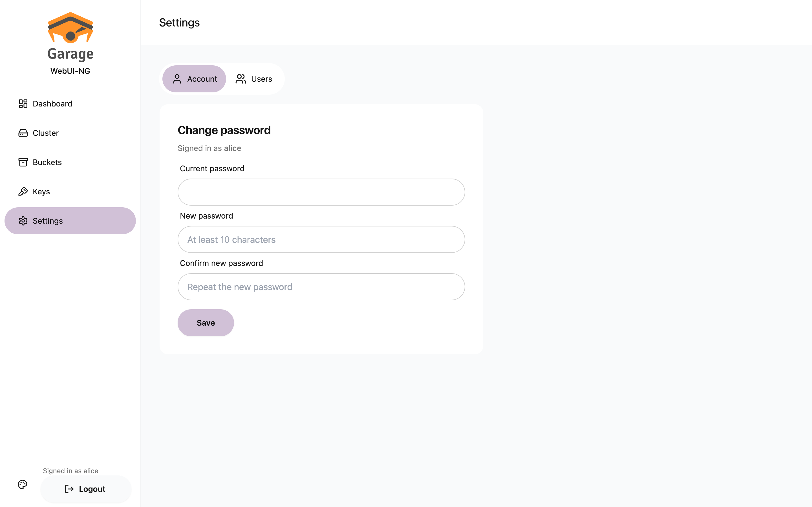](docs/screenshots/settings-account.png) |

**Dark mode**

| Dashboard | Object browser |
|:---:|:---:|
| [](docs/screenshots/dashboard-dark.png) | [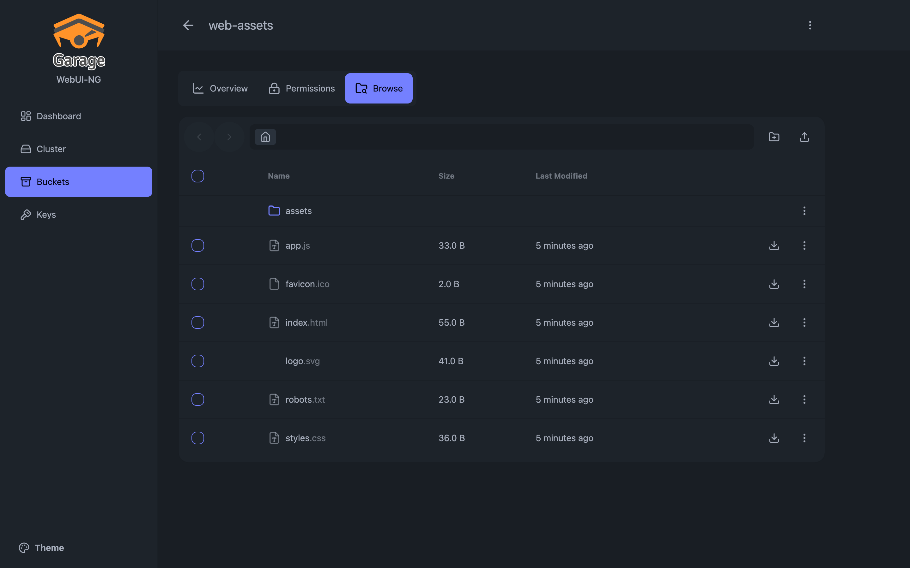](docs/screenshots/browse-dark.png) |

**Mobile**

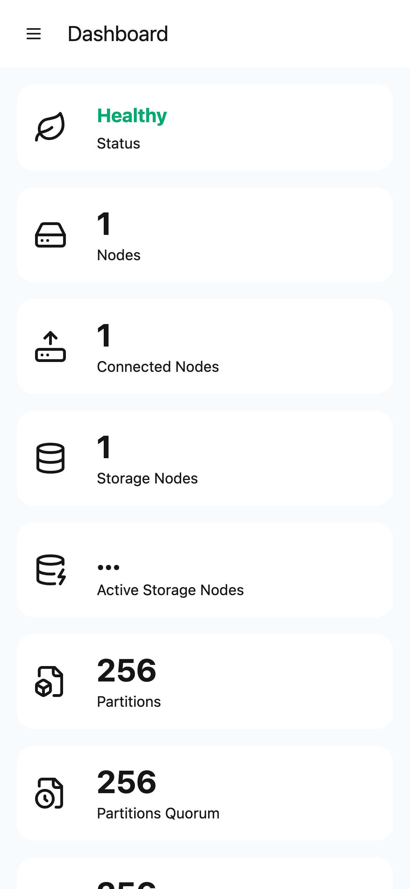 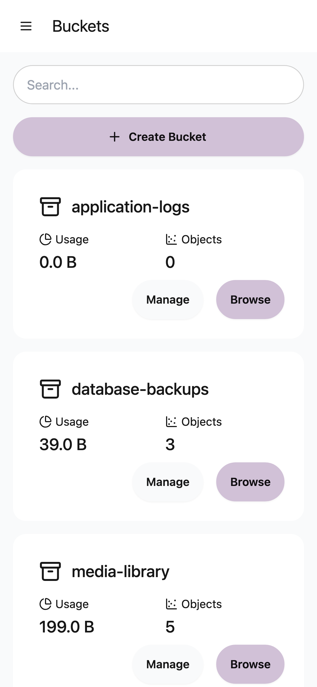 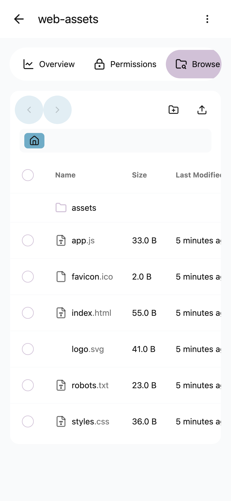

</div>

## 🏗️ Architecture

Garage WebUI-NG is a **gateway** between your browser and two Garage APIs, plus a small local store for its own user accounts.

```
          ┌──────────────────────────────────────────────┐
          │            Garage WebUI-NG (1 binary)         │
 Browser ─┤  React SPA  ─►  Go server                     ├─► Garage Admin API (v2)
   (SPA)  │   (embedded)     ├─ session auth + roles      │      /v2/GetClusterStatus, …
          │                  ├─ audit log (stdout)        │
          │                  ├─ reverse proxy  ───────────┼─► Garage Admin API (catch-all)
          │                  └─ S3 client ────────────────┼─► Garage S3 API
          │                        │                      │      (object browse / share)
          │                  SQLite (users) ──► /data     │
          └──────────────────────────────────────────────┘
```

- **Single artifact** — the Go binary embeds the built frontend via `//go:embed` (release builds only); the same code runs from the non-root Docker image.
- **Admin API gateway** — a few explicit routes plus a catch-all reverse proxy forward any `/api/v2/…` request to Garage's Admin API with the admin token injected server-side. The token is **never** sent to the browser.
- **S3 path** — object browsing/upload/download/sharing uses the AWS SDK v2 with per-bucket credentials fetched (and briefly cached) from the Admin API.
- **Config reuse** — reads your existing `garage.toml` (`CONFIG_PATH`, default `/etc/garage.toml`) for endpoints and tokens; every value can be overridden by an environment variable.
- **One piece of local state** — user accounts live in a SQLite file at `DB_PATH` (`/data/garage-webui-ng.db` in the image). **Mount a persistent volume there.** Nothing else is stored locally.

See [CLAUDE.md](CLAUDE.md) for a deeper architecture reference.

## 🚀 Installation

### Docker (quickest)

```bash
docker run -d --name garage-webui-ng \
  -p 3909:3909 \
  -v ./garage.toml:/etc/garage.toml:ro \
  -v garage_webui_data:/data \
  -e API_BASE_URL=http://garage:3903 \
  -e S3_ENDPOINT_URL=http://garage:3900 \
  --restart unless-stopped \
  ghcr.io/d7eeem/garage-webui-ng:latest
```

Then open **http://localhost:3909** and complete the setup wizard to create the first administrator.

> The `-v garage_webui_data:/data` volume holds the user database. **It is required** — without it, every container recreation wipes your accounts and the setup wizard starts over.

### Prebuilt binary

Download the `linux/amd64` or `linux/arm64` binary from the [latest release](https://github.com/d7eeem/garage-webui-ng/releases) and run it next to your Garage node:

```bash
chmod +x garage-webui-ng-linux-amd64
API_BASE_URL=http://127.0.0.1:3903 S3_ENDPOINT_URL=http://127.0.0.1:3900 ./garage-webui-ng-linux-amd64
```

The user database is created at `./data/garage-webui-ng.db` relative to the working directory; set `DB_PATH` to put it somewhere durable. On first start, open the UI and complete the setup wizard.

## 🐳 Docker Deployment

The image is multi-arch (`linux/amd64`, `linux/arm64`), runs as a **non-root** user (uid/gid `65532`), exposes a **healthcheck**, and shuts down gracefully on `SIGTERM`.

```bash
docker pull ghcr.io/d7eeem/garage-webui-ng:latest
```

Available tags: `latest`, `2`, `2.0`, `2.0.0`, and `sha-<commit>`.

The image declares `VOLUME ["/data"]` for the user database and ships that directory owned by uid `65532`, so a **named volume** works out of the box. If you bind-mount a host directory instead, `chown 65532:65532` it first — otherwise startup fails with `cannot open user database`.

## 🧩 Docker Compose Deployment

A production Compose stack (Garage + WebUI-NG) is provided. Copy the example env file and start it:

```bash
cp .env.example .env       # edit as needed
docker compose up -d
```

`docker-compose.yml` includes named volumes, restart policies, healthchecks, JSON log rotation, environment interpolation from `.env`, and optional Traefik reverse-proxy labels. See [`docker-compose.yml`](docker-compose.yml).

The stack mounts the named volume `webui_data` at `/data` for the user database. On first start, open the UI and complete the setup wizard. Upgrading an existing deployment? Follow [`docs/UPGRADING.md`](docs/UPGRADING.md).

## ⚙️ Configuration

Garage WebUI-NG reads your `garage.toml` and lets every setting be overridden by an environment variable. A full reference lives in [`.env.example`](.env.example).

### Environment variables

| Variable | Default | Description |
|---|---|---|
| `API_BASE_URL` | from `garage.toml` | Garage **Admin API** endpoint (cluster/bucket/key management). |
| `S3_ENDPOINT_URL` | from `garage.toml` | Garage **S3 API** endpoint (object browse/upload/download). |
| `S3_PUBLIC_ENDPOINT_URL` | *(unset)* | Public S3 endpoint the browser can reach — enables **presigned share links**. |
| `S3_WEB_PUBLIC_URL` | *(unset)* | Public base URL for **static website hosting**, overriding the `http://<bucket><root_domain>:<port>` address derived from `garage.toml`. Use `{bucket}` for vhost-style routing (`https://{bucket}.web.example.com`); without it the bucket becomes the first path segment (`https://web.example.com` → `https://web.example.com/mybucket`). Set this whenever a reverse proxy fronts Garage's web endpoint. |
| `MAX_UPLOAD_SIZE_MB` | `512` | Largest single file the object browser accepts, in MB. A larger upload is refused with **413** before it is buffered. Must not exceed the body-size limit of any reverse proxy in front of the app (nginx `client_max_body_size`, Caddy `request_body max_size`). |
| `S3_REGION` | `garage` | S3 region name. |
| `CONFIG_PATH` | `/etc/garage.toml` | Path to the Garage config file to read. |
| `HOST` | `0.0.0.0` | Address the server binds to. |
| `PORT` | `3909` | Port the server listens on. |
| `BASE_PATH` | *(unset)* | Mount the UI under a path prefix (e.g. `/garage`). |
| `DB_PATH` | `/data/garage-webui-ng.db` (image)<br>`./data/garage-webui-ng.db` (binary) | SQLite file holding the user accounts. **Must live on persistent storage.** |
| `SESSION_COOKIE_SECURE` | `false` | Send the session cookie only over HTTPS. Set to `true` behind TLS. |
| `SESSION_LIFETIME_HOURS` | `24` | Absolute session lifetime, counted from sign-in. |
| `SESSION_IDLE_TIMEOUT_HOURS` | `2` | Sign out a session left untouched for this long. |
| `AUTH_USER_PASS` | *(unset)* | **Legacy.** `user:bcrypt-hash` (comma-separated). Imported **once**, on the first start against an empty database, then **ignored forever**. |
| `AUTH_VIEWER_USER_PASS` | *(unset)* | **Legacy.** Read-only viewer accounts, same format and same one-time import. |

> **Users are not configured with environment variables.** Create the first administrator with the setup wizard, then manage accounts in **Settings → Users**. The two `AUTH_*` variables exist only to carry accounts over from a pre-database release; changing them afterwards has no effect. Full details in [`docs/authentication.md`](docs/authentication.md).

## 🖱️ Usage

1. On a brand-new instance, complete the **setup wizard** at `/setup` to create the administrator; it signs you straight in and never reopens.
2. Land on the **Dashboard** for cluster health and live metrics.
3. Use **Cluster** to review nodes, capacity, and the layout.
4. Under **Buckets**, create a bucket, assign an alias, set quotas, or enable website hosting.
5. Open a bucket's **Browse** tab to manage objects; use **Keys** to mint and assign access keys.
6. Add colleagues in **Settings → Users** (admin or read-only viewer); change your own password in **Settings → Account**.

### Importing / Exporting

- **Import (upload)** — open a bucket → **Browse** → the **upload** button (top-right of the toolbar) to add objects, or **new folder** to create a prefix.
- **Export (download / share)** — use the per-row **download** action, or the row menu → **Share** to generate an expiring **presigned link** (15 min → 7 days) or copy the object's **public website URL** when website hosting is enabled.
- **Bulk operations** — select multiple objects to delete them in one request.

### Permanent public asset URLs

Garage has exactly one anonymous-read mechanism — the **website endpoint** —
so "public read" *is* the **Public read (website hosting)** toggle on a
bucket's Overview tab; there is no separate ACL or "public" flag.

1. Create (or open) a bucket and give it a **global alias** — the website
   hostname is derived from it, so a bucket with none cannot be served.
2. On the bucket's **Overview** tab, enable **Public read (website hosting)**.
   Anyone who can reach Garage's website endpoint can now read objects in
   this bucket without signing in; uploads and deletions still require
   credentials.
3. Upload an object in **Browse**. When it finishes, the upload panel offers
   a **Copy URL** action; the same permanent URL is also on the row's
   **Share** dialog and as an **[Open]** link.
4. Set `S3_WEB_PUBLIC_URL` (see [`.env.example`](.env.example)) so those URLs
   point at the address your users can actually reach — it must route to
   Garage's **web** port (`s3_web`/port `3902` in the Compose stack), **not**
   the S3 API port. Without it, URLs are derived from `garage.toml`'s
   `[s3_web] root_domain`, which is usually only reachable inside your
   network.

There is no anonymous directory listing — Garage serves the configured index
document for a prefix and the error document otherwise, never a listing of
the bucket root.

### Command-line flags

The binary is also its own recovery tool. These run offline against the user
database at `DB_PATH` and exit — they never start the server.

| Flag | Purpose |
|---|---|
| `-health` | Local health probe; exits `0` when healthy. Used by the container `HEALTHCHECK`. |
| `-list-users` | Print every account (username, role, status, last login, created). Never prints a password or a hash. |
| `-reset-password <username>` | Prompt for a new password and set it — the fix for a forgotten admin password, with no data loss. |
| `-create-admin <username>` | Prompt for a password and create a new administrator, even when accounts already exist. |

```bash
garage-webui-ng -list-users
garage-webui-ng -reset-password admin

# Docker (-it is required so there is a terminal to prompt on)
docker compose exec webui /main -reset-password admin
```

The password is **prompted for with echo disabled, never passed as an
argument** (argv leaks into shell history and `ps`), and there is deliberately
**no HTTP equivalent** — these need local write access to the database file.
Details: [`docs/authentication.md` §9](docs/authentication.md#9-lockout--recovery).

## 🔌 API

The backend serves everything under `/api`. It is primarily a **gateway to Garage's Admin API v2** (any unmatched `/api/v2/…` request is reverse-proxied with the admin token attached), plus first-class endpoints:

| Method | Path | Purpose |
|---|---|---|
| `GET` | `/api/config` | Browser-safe subset of the Garage config (no secrets). |
| `GET` | `/api/metrics` | Parsed Prometheus metrics for the dashboard panel. |
| `GET` | `/api/buckets` | Enriched bucket list. |
| `GET/PUT/DELETE` | `/api/browse/{bucket}/{key...}` | List / upload / download / delete objects. |
| `POST` | `/api/browse/{bucket}` | Bulk-delete selected objects. |
| `GET/DELETE` | `/api/multipart/{bucket}` | List / abort orphaned multipart uploads. |
| `GET` | `/api/share/{bucket}/{key...}?expires=` | Generate a presigned share link. |
| — | `/api/setup`, `/api/auth/*`, `/api/admin/users*` | Setup wizard, sessions, and user administration. |

The authentication and user-administration endpoints — request fields, response
shapes and every error code — are documented in
**[`docs/authentication.md` §6](docs/authentication.md#6-api-reference)**, so the
two cannot drift.

## 🔒 Security

- **Secrets stay server-side** — `rpc_secret`, `admin_token`, and `metrics_token` are never exposed to the browser (`/api/config` returns a filtered subset).
- **Authentication is mandatory** — there is no open (no-auth) mode. Every API route requires a session except `GET /api/auth/status`, `GET /api/setup/status`, `POST /api/setup` and `POST /api/auth/login`.
- **Passwords** — bcrypt at cost 10; minimum 10 characters. **No endpoint ever returns a password or a password hash**, and none is written to the logs.
- **Sessions** — server-side, with `HttpOnly` + `SameSite=Lax` cookies (`Secure` via `SESSION_COOKIE_SECURE`), an idle timeout *and* an absolute lifetime, and token renewal on every privilege change.
- **CSRF protection** — a double-submit `X-CSRF-Token` is required on every state-changing request, exempting only login and first-run setup.
- **Rate-limited login** — 10 attempts per minute per client IP, shared with setup and the current-password check; failures are indistinguishable between unknown, disabled and wrong-password, in message *and* in timing.
- **Admin / viewer roles** — the viewer role is fail-closed (allowlisted reads, two writes that touch only its own account, no access to secret keys or to user administration), and `/admin/*` is guarded twice, independently.
- **Lockout guards** — the last enabled administrator cannot be deleted, disabled or demoted, and no admin can demote or delete themselves.
- **Audit trail** — mutating requests (incl. denied ones) are logged as structured JSON to stdout for your log pipeline.
- **Hardened runtime** — the Docker image runs as a non-root user with a minimal (distroless) base and no shell.

> Even with authentication mandatory, the backend still proxies the Garage admin token on behalf of a signed-in user. Keep the UI on a trusted network or behind a reverse proxy with TLS (and set `SESSION_COOKIE_SECURE=true`) when exposing it beyond localhost.

Full reference: [`docs/authentication.md`](docs/authentication.md).

## 🗺️ Roadmap

- [x] Live cluster metrics panel
- [x] Bulk object delete & multipart cleanup
- [x] Presigned share links & correct website URLs
- [x] Multi-user auth + read-only viewer role
- [x] Structured audit log
- [x] Persistent user store, first-run setup wizard & in-app user management
- [ ] **Full in-browser multipart upload** (resumable, large-file uploads)
- [ ] Richer static-website hosting management surface
- [ ] Historical metrics (time-series) view
- [ ] Fine-grained RBAC (roles & permissions beyond admin / viewer)
- [ ] Multi-factor authentication (TOTP)
- [ ] OAuth / OIDC and LDAP sign-in

## ❓ FAQ

**Does this replace Garage?** No — it's an admin UI for an existing Garage cluster. [Install Garage](https://garagehq.deuxfleurs.fr/documentation/quick-start/) first.

**Do I need to run it inside Docker?** No. It's a single static binary; Docker is just the easiest deployment.

**A bucket won't browse — why?** Object browsing addresses buckets by **global alias**. Add a global alias to the bucket first.

**How do I create users / generate a bcrypt hash?** You don't need one. Create the first administrator with the setup wizard on a new instance, then add accounts in **Settings → Users**. Passwords are hashed by the app.

*Alternative (legacy import):* on a **brand-new** instance whose database is still empty, `AUTH_USER_PASS=user:$2a$...` (comma-separated for several accounts) seeds those accounts once at startup and is then ignored forever. It exists to carry a pre-database deployment across the upgrade — see [`docs/UPGRADING.md`](docs/UPGRADING.md). To produce a hash for that one-time import:
```bash
htpasswd -bnBC 10 "" 'your-password' | tr -d ':\n' | sed 's/^$2y/$2a/'
```

**I lost every administrator password — what now?** If one admin can still sign in, reset the other account from **Settings → Users**. If nobody can and you have shell access to the host, run `garage-webui-ng -reset-password <user>` (or `-create-admin <user>`) — it prompts for the new password and loses no data. Deleting the database file, which **erases all accounts**, is only the last resort — see [`docs/authentication.md` §9](docs/authentication.md#9-lockout--recovery).

**My users disappear after every deploy.** The `/data` volume is not mounted. See [`docs/UPGRADING.md`](docs/UPGRADING.md).

**Why is lint "red" in CI?** A pre-existing lint backlog is tracked separately and runs non-blocking; new code is kept clean.

## 🤝 Contributing

Contributions are welcome! Please open an issue to discuss substantial changes first. Before submitting a PR, make sure `pnpm run typecheck`, `pnpm run test`, `pnpm run build`, and the backend `go build ./... && go vet ./... && go test -race ./...` all pass.

## 🛠️ Development

**Prerequisites:** Node 20+ with `pnpm` (via `corepack enable`) and Go 1.25+ (the `go` directive in `backend/go.mod` is `1.25.0`, raised by `modernc.org/sqlite`).

```bash
pnpm install
pnpm run dev          # Vite (frontend) + air (backend) together
# or separately:
pnpm run dev:client   # frontend only
pnpm run dev:server   # backend only (cd backend && air)
```

**Useful scripts:**

```bash
pnpm run build        # tsc -b && vite build → dist/
pnpm run typecheck    # tsc -b
pnpm run test         # Vitest
pnpm run lint         # ESLint

cd backend
go build ./... && go vet ./... && go test -race ./...
```

A **release build** (single binary with the embedded UI) is produced by copying `dist/` into `backend/ui/dist/` and running `make` (`-tags=prod`); the [`Dockerfile`](Dockerfile) does this automatically. See [CLAUDE.md](CLAUDE.md) for conventions and architecture notes.

## 📄 License

Released under the [MIT License](LICENSE). Garage WebUI-NG is a next-generation fork; the original copyright is retained below.

## 🙏 Acknowledgements

- **[Garage](https://garagehq.deuxfleurs.fr/)** by [Deuxfleurs](https://deuxfleurs.fr/) — the object storage engine this UI operates.
- **[garage-webui](https://github.com/khairul169/garage-webui)** by **Khairul Hidayat** (© 2024) — the original project this "-NG" edition builds upon, under the MIT License.
